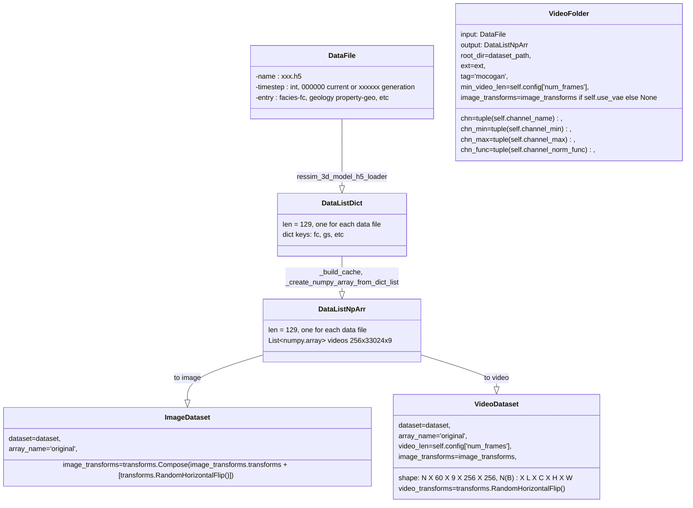

```mermaid
---
Dataloader
---
classDiagram 
    
    class DataFile{
      -name : xxx.h5
      -timestep : int, 000000 current or xxxxxx generation
      -entry : facies-fc, geology property-geo, etc
    }

    class DataListDict{
      len = 129, one for each data file
      dict keys: fc, gs, etc
     }
     
    class DataListNpArr{
      len = 129, one for each data file
      List~numpy.array~ videos 256x33024x9
    }
    
    class VideoFolder{
            input: DataFile
            output: DataListNpArr
            root_dir=dataset_path,
            ext=ext,
            tag='mocogan',
            chn=tuple(self.channel_name),
            chn_min=tuple(self.channel_min),
            chn_max=tuple(self.channel_max),
            chn_func=tuple(self.channel_norm_func),
            min_video_len=self.config['num_frames'],
            image_transforms=image_transforms if self.use_vae else None
        }
        
    class ImageDataset{
                dataset=dataset,
                array_name='original',
                image_transforms=transforms.Compose(image_transforms.transforms + [transforms.RandomHorizontalFlip()])
            }
            
    class VideoDataset{
                shape: N X 60 X 9 X 256 X 256,  N (B) X L X C X H X W
                dataset=dataset,
                array_name='original',
                video_len=self.config['num_frames'],
                image_transforms=image_transforms,
                video_transforms=transforms.RandomHorizontalFlip()
            }
    DataFile --|> DataListDict : ressim_3d_model_h5_loader
    DataListDict --|> DataListNpArr :_build_cache, _create_numpy_array_from_dict_list
    
    
    DataListNpArr --|> ImageDataset: to image
    DataListNpArr --|> VideoDataset: to video


```
