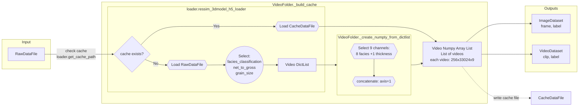
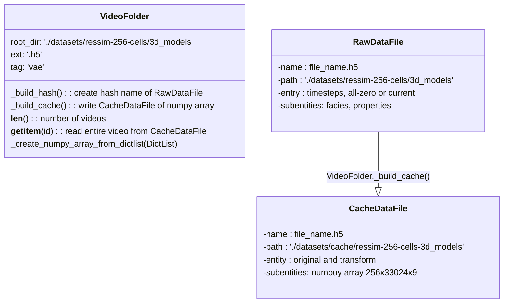

* RawDataFile
    * facies
        * channel_lag, crevasse_splay, erosion, hiatus, levee, mud_pug, overbank, point_bar
    * properties
        * thickness, topograpghy, facies-calssficationn, grain-szie, porosity, etc
>  RawDataFile is encrypted by a hash:
> 1. Class: 3d_models
> 1. Filename: xxxxx.h5
> 1. most recent modified time

_**RawDataFile is encrypted by a hash with 3 properties:**_

> - Class: 3d_models
> - Filename: xxxxx.h5
> - most recent modified time

> e.g., hash of  **RawDataFile: video_i**
```python
class = "3d_models"
filename = "ChannelBelt3D-1dad52d4-94b3-3e25-af1a-6f6e05a8c2d2-25865-566cbe8e-3b6a-3cb8-8fbd-b2626e206d25-36997.h5"
mtime = os.path.getmtime(filename)

hash_str = "[('3d_models', 'ChannelBelt3D-1dad52d4-94b3-3e25-af1a-6f6e05a8c2d2-25865-566cbe8e-3b6a-3cb8-8fbd-b2626e206d25-36997.h5', 1651766445.0)]"

hash = hashlib.md5(hash_str.encode('utf-8')).hexdigest()
```

To load `RawDataFile` to `ImageDataset` or `VideoDataset`


```python
    def ressim_3dmodel_h5_loader(Str): 
        # input is path-to-RawDataFile
        # if CacheDataFile exists, it will load CacheDataFile and output Video Numpy Array List
        # if CacheDataFile does not exist, it will read RawDataFile and create DictList
     
    def _create_numpy_array_from_dictlist(DictList):
        # select 9 channels: 8 facies + 1 thickness from DictList keys
        # generate video numpy array in shape: 256 x {256x129} x 9
        # the output should be video_original_numpy
```
```
    Video Dict List{
        - List contains videos
        - each video is a dict
        - dict contains keys selected from RawDataFile: ntg, fc, gs, etc
        - dict value is a 3D numpy array of shape 129 x 256 x 256
        - first dimension 129 is video length, 256 x 256 is domain size
     }
     
    Video Numpy Array List{
        - List contains videos
        - each video is a 3D numpy array of shape 256 x 33024 x 9
        - last dimension is channel: 1 thickness + 8 facies
        - second dimension is concatnated: 33024 = 129 x 256
        - 129 is video length, 256 is domain size
     }
```
    
        




