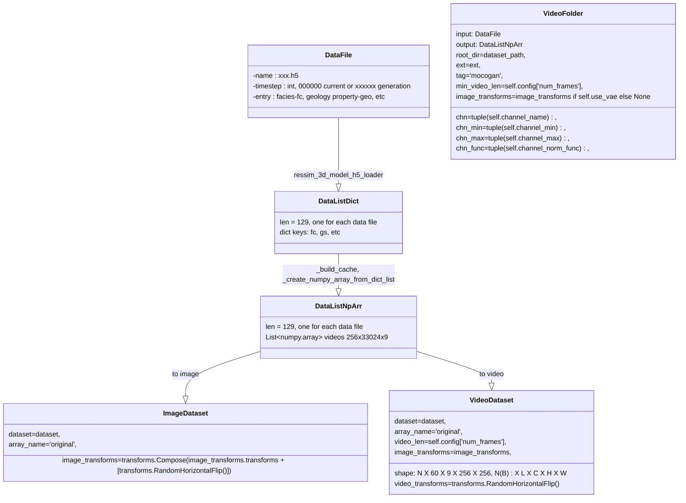

# MoCoGAN code map
## use MoCoGAN to generate 3D geological realizations conditioning on log data.
## Key parts to understand model: 
- Dataset
  - Preprocess: path to data, normalize, container
  - Postprocess
- Train
  - optimizer/schedule (type, tunable variables, learining rate, decay schedule)
  - dataloader: batch number, batch size, normalize
  - loss function: BCE, KL
  - validation: intervels, validation data size
  - metrics: same to loss
- Model
  - Input
  - Output
  - Model structure: input size, layers or modules, output size
  - save and load (checkpoints): what need to be save, any indicators of model structure?

Model contains Generator (***G***) and video Discriminator (***D<sub>v</sub>***) and image Discriminator (***D<sub>i</sub>***)

### *G*:
Model structure
```python
 class VideoGenerator(
   output_size: (Int,Int), # H X W
   n_output_channels: Int, # number of facies
   dim_z_content: Int, # dimension of z content, 50 in config.yaml
   dim_z_motion: Int, # dimension of z motion, 100 in config.yaml
   video_len: Int, # D
   ngf=64, # the hiddent dimension
   output_tanh=True # flag of using Tanh activitation function at output layer
 )
 ```

input includes a content vector ***z<sub>c</sub>*** and a motion vector ***z<sub>m</sub>***, which are given to ```forward''' function in order 

```python
   input_content: torch.float64   # B x dim_z_content x 1 x 1, on device, e.g., input_content = torch.randn(batch_size, self.dim_z_content, 1, 1, device=device)
   input_motion: torch.float64    # B x dim_z_motion x 1 x 1, on device, e.g., input_content = torch.randn(batch_size, self.dim_z_motion, 1, 1, device=device)
   VideoGenerator.forward(input_content, input_motion)
```

### *G*:
Model structure
```python
 class VideoGenerator(
   output_size: (Int,Int), # H X W
   n_output_channels: Int, # number of facies
   dim_z_content: Int, # dimension of z content, 50 in config.yaml
   dim_z_motion: Int, # dimension of z motion, 100 in config.yaml
   video_len: Int, # D
   ngf=64, # the hiddent dimension
   output_tanh=True # flag of using Tanh activitation function at output layer
 )
 ```

input includes a content vector ***z<sub>c</sub>*** and a motion vector ***z<sub>m</sub>***, which are given to ```forward''' function in order 

```python
   input_content: torch.float64   # B x dim_z_content x 1 x 1, on device, e.g., input_content = torch.randn(batch_size, self.dim_z_content, 1, 1, device=device)
   input_motion: torch.float64    # B x dim_z_motion x 1 x 1, on device, e.g., input_content = torch.randn(batch_size, self.dim_z_motion, 1, 1, device=device)
   VideoGenerator.forward(input_content, input_motion)
```
Functionals:
```python
  def _load_config(self, argv):
    '''
    argv is from command line
    self.config_file is from input "-c" or "--config" filename
    read from argv will override config_file
    '''
    
  def _load_channel(self):
    '''
    actually reads from config_channels.yaml, 
    each channel has name (thickness and 8 facies), normalization, denormalization
    only "current-thickness" (at the first dimension) has real normalization (expit, log) and denormalization (exp, logit) functions
    other 8 facies only takes min-max nornalization resulting in [0,1]
    outputs 5 lists:
      self.channel_name
      self.channel_min: None for thickness
      self.channel_max: None for thickness
      self.channel_norm_func: None for facies
      slef.channel_denorm_func: None for facies
    '''
   def _load_dataset(self):
      '''
      self.dataset is the path of data library (ressim-256-cells), it should has a subfolder (3D_models) contains all data files (xxxxxx.h5)
      return image_dataset, video_dataset
      
      '''
```


